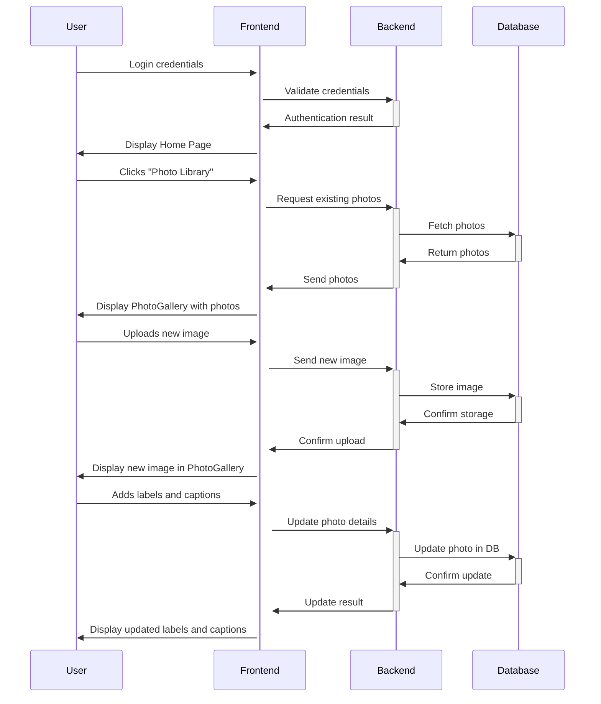

### Photo Upload Process
 

```mermaid

sequenceDiagram
    participant U as User
    participant F as Frontend
    participant B as Backend
    participant DB as Database

    U->>+F: Login credentials
    F->>+B: Validate credentials
    B->>-F: Authentication result
    F->>U: Display Home Page

    U->>+F: Clicks "Photo Library"
    F->>+B: Request existing photos
    B->>+DB: Fetch photos
    DB->>-B: Return photos
    B->>-F: Send photos
    F->>U: Display PhotoGallery with photos

    U->>+F: Uploads new image
    F->>+B: Send new image
    B->>+DB: Store image
    DB->>-B: Confirm storage
    B->>-F: Confirm upload
    F->>U: Display new image in PhotoGallery

    U->>+F: Adds labels and captions
    F->>+B: Update photo details
    B->>+DB: Update photo in DB
    DB->>-B: Confirm update
    B->>-F: Update result
    F->>U: Display updated labels and captions
```
